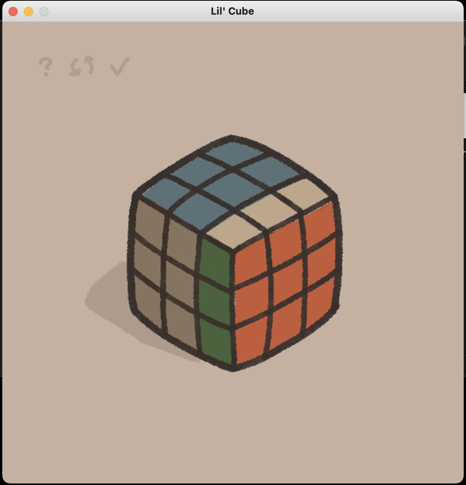
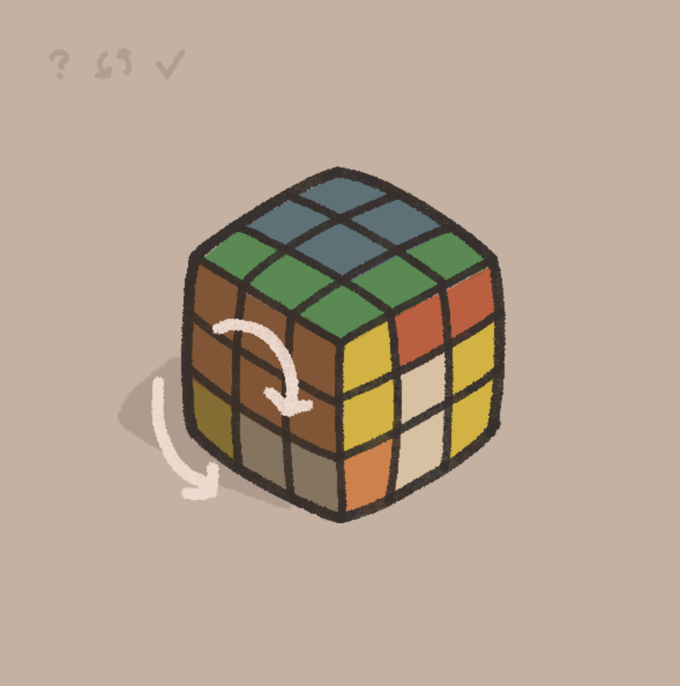

# RubiksCubeSim

##Introduction
This is a Rubik's cube simulation and UI. The goal of this project was to properly simulate a rubik's cube and to make a simple interface for manipulating it.

##Technologies
- Python 3.9.6
- Pygame
- shapely

##Launch
Download all associated files. Make sure Pygame and Shapely are installed properly. Run the LilCube.py file.
It should look something like this.

##Features
- Arrow keys can rotate the cube along the X and Y axis
- Hover over the question mark to see additional tips
- Click the Rotating Arrows in the top right to scramble
- Click the Check Mark to solve the cube
- Hover over any of the three faces and use the left and right arrows to rotate the selected face clockwise and counterclockwise respectively

Enjoy!
